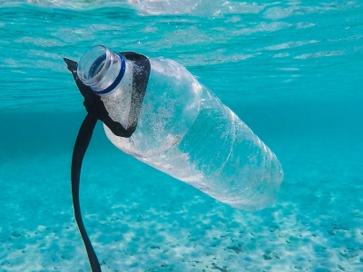
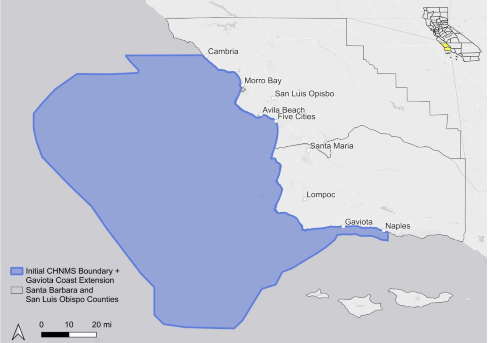

# ASSESSING MARINE DEBRIS IN THE PROPOSED CHUMASH HERITAGE NATIONAL MARINE SANCTUARY

#### Waste-Free Waves, A Group Project submitted in partial satisfaction of the requirements for the degree of Master of Environmental Science & Management for the Bren School of Environmental Science & Management

California is both a major source of anthropogenic marine debris and an area particularly vulnerable to its damaging impacts. However, little is known about the quantities and impacts of marine debris in the proposed Chumash Heritage National Marine Sanctuary (CHNMS) along the central coast of California. This project, conducted by graduate students through the Bren School of Environmental Science & Management at the University of California, Santa Barbara, creates a baseline assessment of marine debris in the proposed CHNMS. It aims to inform the National Oceanic and Atmospheric Administration (NOAA) Sanctuaries West Coast Regional Office, along with sanctuary management partners and local communities, about local marine debris and potential management measures. Existing community science beach cleanup data and primary collected data were analyzed to understand spatial patterns in quantities and types of marine debris. We found that plastic debris is the most common material type; areas with the greatest debris densities are likely the Morro Bay, Avila Beach, Five Cities, and Gaviota Coast areas. Smoking, eating, and drinking are major activities that contribute to coastal debris in this region. Alongside this quantitative analysis, analyses of policies and interviews with agencies, local organizations, research institutes, and Indigenous communities revealed that current policies may not be effective at reducing marine debris, despite strong concern for marine debris and its impacts on the coastal environment in this region. Based on these findings, we recommend streamlining debris collection protocols with standardized debris categories and effort metrics, implementing innovative policies to reduce marine debris sources, ensuring co-stewardship of the CHNMS to include and prioritize Indigenous perspectives, and conducting additional research on marine and land-based sources of debris. These recommendations will enhance monitoring and mitigation of marine debris in the CHNMS.

## **Contact Information**

#### Group Project Team Member Contact Information

-   Tatiana Bok - [tatianabok\@bren.ucsb.edu](mailto:tatianabok@bren.ucsb.edu)

-   Elizabeth Braun - [ebraun\@bren.ucsb.edu](mailto:ebraun@bren.ucsb.edu)

-   Eleri Griffiths - [egriffiths\@bren.ucsb.edu](mailto:egriffiths@bren.ucsb.edu)

-   Heather Luedke - [hluedke\@bren.ucsb.edu](mailto:hluedke@bren.ucsb.edu)

-   Anne Youngdahl - [ayoungdahl\@bren.ucsb.edu](mailto:ayoungdahl@bren.ucsb.edu)

#### Client Contact Information 

-   Laura Ingulsrud (NOAA Office of National Marine Sanctuaries West Coast Regional Office) - [laura.ingulsrud\@noaa.gov](mailto:laura.ingulsrud@noaa.gov)

#### Faculty Advisor Contact Information 

-   Steve Gaines (UCSB Bren School) - [gaines\@bren.ucsb.edu](mailto:gaines@bren.ucsb.edu)

## **General Information**

#### Data Collection Dates 

-   Data were obtained from existing sources from May through October 2023

-   Primary data collection occurred from July through October 2023 

-   Data sets included data from January 2015 through October 2023 

#### Geographic Location of Data Collection

-   Collected from Santa Barbara and San Luis Obispo County coastlines in California
-   Filtered to the proposed Chumash Heritage National Marine Sanctuary maximum possible boundary extents (Cambria, California, to Naples, California)

    
    
## **Sharing & Access Information**

#### Data Licensing 

The final products and the synthesized data of this project were published under the Creative Commons Zero (CC0) intellectual property laws to enable public use. The goal was to enable agencies, stakeholders, Indigenous groups, and other individuals concerned about or working on marine debris to access our data. All our synthesized data and code are available through links in this README file and in our [GitHub repository](https://github.com/WasteFreeWaves/assessing_marine_debris). Please note that data from each different source we utilized has their own usage restrictions, so please refer to each source for more information. 

#### Data Sources

**Observed Data:**

-   [The Surfrider Foundation Marine Debris Data](https://cleanups.surfrider.org/results/). Data can be visualized on Surfrider's website but is not available for download. Reach out to Surfrider directly for data downloads. 

-   [Marine Debris Tracker Marine Debris Data](https://debristracker.org/data)

-   [Trash Information and Data for Educaiton and Solutions (TIDES) Marine Debris  Data](https://www.coastalcleanupdata.org/reports)

-   Proposed Chumash Heritage National Marine Sanctuary Boundaries. Two shapefiles were utilized, one outlining the [Initial Boundary Alternative](https://nmssanctuaries.blob.core.windows.net/sanctuaries-prod/media/chumash/2023-chnms-boundary-alternative-maps.pdf), and one outlining the [Agency-Preferred Alternative](https://nmssanctuaries.blob.core.windows.net/sanctuaries-prod/media/chumash/2023-chnms-boundary-alternative-maps.pdf). Shapefiles are not publicly available, so contact Laura Ingulsrud at [laura.ingulsrud\@noaa.gov](mailto:laura.ingulsrud@noaa.gov) for more information. 

-   [California County](https://data.ca.gov/dataset/ca-geographic-boundaries/resource/b0007416-a325-4777-9295-368ea6b710e6?inner_span=True) and [State](https://data.ca.gov/dataset/ca-geographic-boundaries/resource/3db1e426-fb51-44f5-82d5-a54d7c6e188b) Shapefiles. County shapefiles were downloaded in February 2023. State shapefiles were downloaded in August 2023. 

**Collected Data:**

-   [Original Marine Debris Collected Data](WorkingData/fieldwork_data.csv). 
    These data were also uploaded to the [Marine Debris Monitoring and Assessment Project         (MDMAP)](https://mdmap.orr.noaa.gov/). Metadata for this data set generally follows the 
    MDMAP metadata format, but detailed information about each variable can be found 
    [here](WorkingData/fieldwork_metadata.csv). Data were collected from July 2023-October 
    2023 along the Santa Barbara County coast by the Principal Investigators and an 
    undergraduate intern and were used to supplement observed marine debris data.
    
-   Interview data. Interviews were conducted with 13 individuals; however, interview responses are confidential (UCSB Human Subjects Committee Protocol Number 35-23-0427). More information regarding confidential interviews can be found by emailing the [UCSB Human Subjects Committee](https://www.research.ucsb.edu/human-subjects/about) at                       [hsc@research.ucsb.edu](mailto:hsc@research.ucsb.edu). 
    
## **Synthesized Data** 

#### [Marine Debris Synthesized Data](Outputs/all_data_combined.csv)

We reclassified marine debris data from our three observed sources and our collected data source into a single file for analysis. This file contains 40 item type categories, 6 material type categories (plastic, glass, metal, cloth, paper and wood, mixed), and 7 source activity categories (personal hygiene, recreation, smoking, eating and drinking, fishing, dumping, and various) for utilization in further analyses. For more information on how data were classified and what each category includes, see the methodology and results section of the [final report](https://bren.ucsb.edu/sites/default/files/2024-04/WasteFreeWaves_FinalReport.pdf). This data set contains 907 rows with 73 variables. Each row is a separate cleanup within the proposed CHNMS coastline. Metadata containing details about each variable is available [here](Outputs/all_data_metadata.csv). 

#### [Interview Response Summary](Interviews/InterviewGroupedResults.csv) 
We conducted interviews with 13 individuals from four groups: agencies, Indigenous communities, local organizations, and research institutes. The goal was to understand community concerns and areas of opportunity regarding marine debris management in the Central California region. The interview instrument can be found in Appendix III of the [final report](https://bren.ucsb.edu/sites/default/files/2024-04/WasteFreeWaves_FinalReport.pdf). The IRB Human Subjects Approval Letter can be found in Appendix IV. Due to the confidential nature of these results, only summary information, linked above, is available for public access. 

## **Data Pipeline and Analysis Process**

To make this project reproducible and to allow future marine debris monitoring and analysis efforts to build on this project's work, all of the code used in the project is accessible in this [GitHub Repository](https://github.com/WasteFreeWaves/assessing_marine_debris). This readme provides information on the data and analyses used for the project, providing a roadmap for future use. 

#### Software

The following software versions were used for data analysis: 

-   RStudio Version: Version 2023.06.1+524 (2023.06.1+524)
-   QGIS Version: 3.22.14-Białowieża
-   ArcGIS Pro Version: 2.9.5

#### RStudio 

Using R in RStudio was the primary approach for data analysis for this project. Analyses are organized in the following .Rmd files: 

-   [Data Cleaning](data_cleaning.Rmd): Prepares data from all our observed and collected sources for future analyses and harmonization. 
-   [Data Harmonization](harmonization.Rmd): Manually reclassifies all the data and combines the data sets into our [synthesized data file](Outputs/all_data_combined.csv), also linked above. Appendix II in our [final report](https://bren.ucsb.edu/sites/default/files/2024-04/WasteFreeWaves_FinalReport.pdf) shows how we reclassified each original item. This data harmonization file also analyses what items are the most common within the plastic material type and the eating and drinking source activity for each of the four marine debris data sets. 
-   [Summary Stats](SummaryStats.Rmd): Runs and visualizes summary statistics. Code includes analyses on proportions of material types and source activities, as well as summaries of the most common item types. 
-   [Hotspot Analysis](Hotspots_v2.Rmd): Pulls coastal segments from GIS (see below) and conducts a hotspot analysis to identify stretches of coastline with the highest and lowest debris densities. This file also contains summary statistics by hotspot. 
-   [Policy Analysis](PolicyAnalysis_v2.Rmd): Assesses the effectiveness of waste reduction policies (California's plastic straw ban, a San Luis Obispo County ban on Styrofoam takeout containers, and a Grover Beach ban on Styrofoam takeout containers) on reducing marine debris along the study area's coast. Visualizes three time series graphs for debris types associated with these policies to assess potential policy impact. 

#### GIS 

Both QGIS and ArcGIS were used for spatial analyses and visualizations, based on user preference and background knowledge. However, all analyses should be able to be conducted completely in QGIS or in ArcGIS. GIS was specifically used to: 

-   Create a CHNMS boundary shapefile with the greatest possible boundary extents (from Cambria, California, to Gaviota, California) for filtering marine debris data and visualizations 
-   Develop a 1 mile buffer along the coastline to filter cleanups to those that occurred along the coast, excluding inland and ocean cleanups 
-   Divide the CHNMS coastline into 15 equidistant segments based on geographic features for a hotspot analysis 
-   Create maps and visualizations of findings 

Additional information on how these analyses were run can be found in the GIS_steps folder in GitHub, as well as here:

-   [CHNMS Boundary and Buffer Creation Steps](GIS_steps/boundary_buffer_creation_qgis_steps.html) 
-   [Coast Segmentation for Hotspot Analysis Steps](GIS_steps/hotspot_segment_arcgis_steps.html)

The coordinate reference system utilized for all spatial analyses was ESPG4269 (NAD83). 

## **Recommended Citation & Acknowledgements**

#### Recommended Citation

Bok, T., Braun, E., Griffiths, E., Luedke, H., Youngdahl, A. (2024). Assessing Marine Debris in the Proposed Chumash Heritage National Marine Sanctuary <https://github.com/WasteFreeWaves/assessing_marine_debris >

Refer to the individual data sources for sample collection information. 

#### Acknowledgements
We would like to extend our gratitude and appreciation to our clients, Laura Ingulsrud and William Douros, at the NOAA Office of National Marine Sanctuaries West Coast Regional Office. We would also like to thank our faculty advisor, Steve Gaines, our external advisors, and all the additional individuals and organizations that generously gave their time, guidance, and support to this project and team throughout the past year. 

We would also like to thank the MEDS capstone project [Developing a Data Pipeline for Kelp Forest Modeling](https://github.com/kelpGeoMod/kelpGeoMod-capstone-project/tree/main) for sharing their metadata documentation as a reference for this project. 
